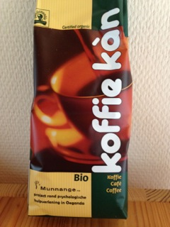

# Analoog

Maatschappelijke zetel: 
Munnange vzw 
Kiekenstraat 81 
9000 Gent 
Belgi&euml; 
Ondernemingsnummer: 0840.255.174 

De Raad van Bestuur van Munnange bestaat uit volgende personen:

* Maika Luyssaert (voorzitter)
* Anke Heyerick
* Wim Vinckier

# Digitaal

Digitaal is het Munnange Counseling Center te vinden op:

* Facebook: <a href="https://www.facebook.com/pages/Munnange-Counseling-Center/1552568298304581">
  Munnange Couseling Center</a>
* Per email: <a href="mailto:munnange.vzw@gmail.com">munnange vzw</a>
	
# Steun ons!

Vzw Munnange blijft ook rekenen op uw steun om de werking verder uit te
bouwen en te onderhouden.
	

U kan dit doen door een &eacute;&eacute;nmalige gift of via een permanente
opdracht. Wij willen ook een warme oproep doen om activiteiten te organiseren binnen
uw verenigingen, scholen, bedrijven, vrienden- of familiekring en een deel
of de volledige opbrengst daarvan te schenken aan vzw Munnange. 
Ons rekeningnummer is IBAN BE91 363-0924058-76

*Zin in een heerlijke kop Oegandese koffie?*

Wij verkopen pakjes gemalen en ongemalen koffie van 250 gram voor de prijs
van €6 per pakje. Indien u interesse hebt om deze aan te kopen voor eigen
gebruik, om te serveren op een evenement of in uw etablissement, neem
hiervoor contact op met Maika Luyssaert of iemand van de raad van bestuur
via <a href="mailto:munnange.vzw@gmail.com">munnange.vzw@gmail.com</a>.
Indien u een grote hoeveelheid wenst aan te kopen, dan kunnen wij samen met
u een aantrekkelijke prijs overeenkomen.

Dankjewel namens alle mensen in Oeganda en het voltallige Munnange team!
