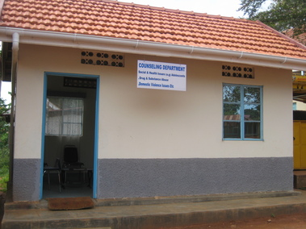

# Ontstaan

Uit onderzoek gedaan door doctoraat studenten aan Oegandese universiteiten
blijkt dat studenten en docenten nood hebben aan psychologische zorg en
ondersteuning. De voorbije jaren zag men in Oeganda de zelfdodingscijfers
toenemen en ook geweldplegingen doen zich frequenter voor. Tijdens
contacten aan de Nkumba University in Entebbe werden we geconfronteerd met de
omvang en de gevolgen van psychisch lijden en de emotionele noden waarbij geen
of te weinig toegankelijke hulp wordt geboden. Er is gebrek aan personeel,
aan knowhow en aan een concreet hulpverleningsaanbod op scholen en universiteiten
om aan deze psychologische en emotionele noden tegemoet te komen. Studenten
en docenten worden geconfronteerd met familiale problemen, moeilijke
thuissituaties, seksuele problemen, emotionele problemen en gezondheidsproblemen
(HIV/Aids) en trekken aan de alarmbel.

Vanuit de overtuiging dat we een verschil kunnen maken werd in 2011, in
samenwerking met Nkumba Univeristy, vzw Munnange opgericht. Munnange
betekent "mijn vriend" in het Luganda, &eacute;&eacute;n van de meest gesproken
talen in Oeganda.

# Missie en visie

Vzw Munnange denkt met een open geest, vanuit respect voor elke eigenheid,
godsdienst of kleur.

Wij vinden het voor onszelf onaanvaardbaar om in een wereld te leven waarin
intelligente en gemotiveerde studenten en docenten die graag hun steentje willen
bijdragen aan de ontwikkeling en vooruitgang van hun land die kans niet krijgen
omdat ze teveel en te vaak benomen worden door zorgen, persoonlijke problemen
en/of familiale spanningen.

Wij willen Oegandese studenten en docenten aan Nkumba University in Entebbe,
maar ook de omliggende communities, de kans geven een beroep te doen op goed
geschoolde en neutrale counsellors bij wie zij hun verhaal kwijt kunnen, een
luisterend oor vinden, begeleiding kunnen krijgen, doorverwezen kunnen worden
naar andere hulpverlening, kortom bij wie ze een plek vinden om tot rust te
komen.

Via gastcolleges en workshops aan Nkumba University zorgen wij samen met
Vives-Ipsoc voor de nodige uitwisseling van kennis en expertise. Via deze weg
wil vzw Munnange komen tot een verbetering van het onderwijs als bouwsteen van
een solide samenleving.

Vzw Munnange vertrekt vanuit het eigen krachtmodel, dwz dat we de
competenties en krachten die reeds aanwezig zijn, willen versterken. Een
maatschappij kan sterker groeien vanuit kennis veeleer dan enkel vanuit
caritatieve of materi&euml;le hulp.

# Doelstellingen 

Vzw Munnange wil zich richten op structurele veranderingen, veeleer dan op
individuele veranderingen of het lenigen van individuele noden en concentreert
zich op de doelstelling van het uitbouwen van een aanbod voor psycholgische
hulpverlening in Oeganda:

* **Centrum voor psychologische hulpverlening op de campus van
  Nkumba University:**

  Het Munnange Counselling Centre werd officieel geopend in april 2012 en heeft
  sinds oktober 2013 drie deeltijdse en betaalde Oegandese counsellors in dienst,
  nl Michael, Abdu en Jamilah. Het hulpverleningsaanbod bestaat vandaag
  voornamelijk uit psychologische zorg voor studenten en docenten van de
  universiteit maar is ook voldoende toegankelijk voor de omliggende communities
  (out-reaching).

* **Outreachende hulpverlening:** 

  
  Sinds onze oprichting kregen we verscheidene vragen van organisaties en scholen
  in de directe omgeving van Nkumba University om counselling sessies voor hun
  doelgroep te organiseren. Uiteindelijk gingen we met twee scholen een intensieve
  samenwerking aan. Early learning School en St Noah Secondary School. 
  Early Learning School is een opvangcentrum en school voor weeskinderen,
  kinderen van ouders die in de gevangenis verblijven of kinderen die door hun
  gezin worden verstoten. Munnange biedt er zowel individuele counselling als
  groepscounseling aan. De kinderen en jongeren geven aan dat deze gesprekken
  hen kracht geven en het dagelijks leven een beetje lichter maken. 
  St Noa Secondary School richt zich vooral op kinderen en jongeren uit
  vissersgezinnen. Deze gezinnen worden nog al te vaak gekenmerkt door
  alcoholmisbruik, familiaal geweld, weinig betrokkenheid van ouders op kinderen.
  De directie van St Noah verwijst jongeren op regelmatige tijdstippen door naar
  Munnange Counselling Centre en contacteert onze medewerkers om te bemiddelen
  en te ondersteunen wanneer er zich op school problemen voordoen. 
  <!--img style="WIDTH: 201px; HEIGHT: 254px" src="MyImages/IMG_5481.jpg" width="226" height="305" imageid=""-->

* **Sattelietkantoor in Kisubi Hospital:**

  <!--img src="MyImages/IMG_6525.jpg" width="293" height="203" style="float:left;"-->
  
  In oktober 2013 startten we ook een satteliet kantoor in Kisubi hospital,
  zo&#39;n 5km van de campus van Nkumba University. Na een aantal verkennende
  gesprekken met dr Robert gingen we in op de vraag om een vaste Munnange
  counsellor op vaste momenten te detacheren naar het hospitaal. Wij geven daar
  counselling, zowel aan ambulante als aan residentiële patiënten. We zijn ontzettend
  blij met deze stap want het betekent dat we ons verankeren in bestaande
  gezondheidsorganisaties waardoor we de toekomst van ons project verzekeren op
  lange termijn.

Aangezien we merken dat de vraag naar hulpverlening groot is en er hier een
beperkt hulpverleningsaanbod voor is in Oeganda, hopen we in de toekomst ons
outreachende hulpverlening verder uit te kunnen breiden. We proberen ook kennis
en expertise uit te wisselen vanuit België, dit in samenwerking met de
Katholieke Hogeschool VIVES. Er werden al verschillende workshops en
conferenties georganiseerd op de campus van Nkumba University om de opleiding
&quot;Psychological guidance and counselling&quot; te versterken, wat op termijn zal
leiden tot een uitgebreid sociaal en professioneel netwerk en tot nog beter
geschoolde counsellors. Dankzij de Katholieke Hogeschool VIVES worden er ook
internationale stages georganiseerd waarbij studenten projecten uitwerken in
functie van vzw Munnange.

